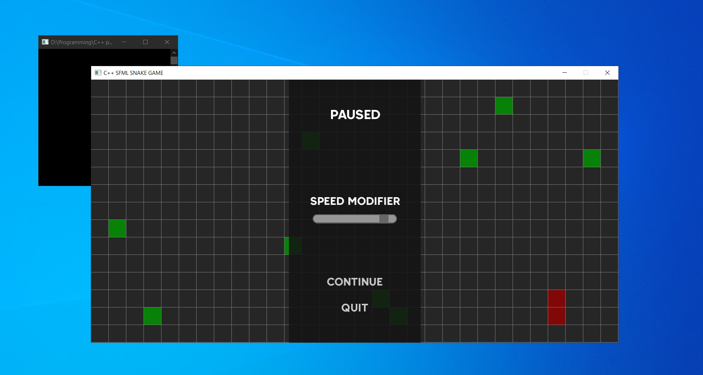

# Snake-Game

# Project Description:
The project includes 3 modules:
* PLAY
* FAKE AI
* SETTINGS

In PLAY module you can change the snake direction using arrows or wsad keyboard keys.
In the FAKE AI module the Snake moves along a fixed path. I generate the path in other program using some graphs algorithms.
If you want to pause or unpause (in both PLAY and FAKE AI modules) you have to press Esc keyboard key.

-> [Link to a video showing how the program exactly works](https://drive.google.com/file/d/1AUq5HGM_vGRmZRU2HOHWQZS6_72ko7sT/view?usp=sharing) <-

# How to install:
If you're familiar with git you can clone the repo. Otherwise you can simply download whole project as a compressed folder.

